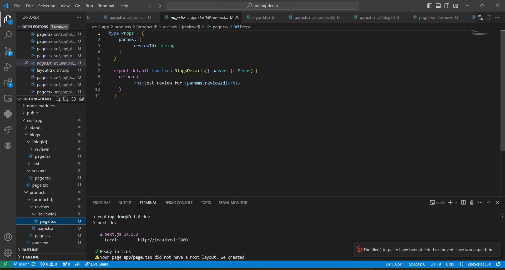

This is a [Next.js](https://nextjs.org/) project bootstrapped with [`create-next-app`](https://github.com/vercel/next.js/tree/canary/packages/create-next-app).

## Getting Started

First, run the development server:

```bash
npm run dev
# or
yarn dev
# or
pnpm dev
# or
bun dev
```

Open [http://localhost:3000](http://localhost:3000) with your browser to see the result.

## Praktikum 1
Todo: Buatlah halaman /profile yang menampilkan isi biodata anda dengan menggunakan routing di NextJS.


## Praktikum 2
Dengan menggunakan konsep yang sama pada Praktikum 1, silahkan tambahkan susunan folder /blogs/first dan /blogs/second. Kemudian tambahkan masing-masing untuk setiap folder dengan file page.tsx.
Pada file /blogs/page.tsx buatlah function component seperti kode berikut atau anda dapat mengkreasikan tampilan dengan selera anda!


Todo: Lengkapi function component pada /blogs/second/page.tsx


Apa kekurangan yang mungkin terjadi jika menggunakan pendekatan pada Praktikum 2 untuk menangani routing?
~file akan terlalu besar dan banyak, karena setiap perpindahan page mengakses file lain jadi akan ada terlalu banyak file jika menggunakan metode dalam praktikum 2

## Praktikum 3
Buatlah file /products/page.tsx yang berisi function component untuk menampilkan list dari products seperti kode berikut.


Untuk mendefinisikan url path di NextJs menggunakan konvensi penamaan direktori dengan mengapit nama path dengan simbol [ ]. Sebagai contoh: productId menandakan bahwa path dinamis menggunakan variabel productId (Catatan: Anda boleh menuliskan hanya dengan [id], tetapi untuk mempermudah pembacaan konteks sebaiknya jangan gunakan hanya id).
Kemudian buatlah file page.tsx pada lokasi /app/products/productId dan tambahkan kode sebagai berikut.

Untuk mendapatkan nilai path, anda dapat menggunakan pemanggilan params.productId. Pemanggilan atribut params, disesuaikan dengan pendefinisian nama path.
Cobalah akses halaman /products dan /products/1 pada browser anda. Ubah nilai productId dengan nilai lainnya.


Todo 1: Perbaiki implementasi Praktikum 2 menggunakan Dynamic Routes


Todo 2: Dengan menggunakan konsep Nested Routes dan Dynamic Routes, buatlah halaman dengan routing /products/[productId]/reviews/[reviewId]



